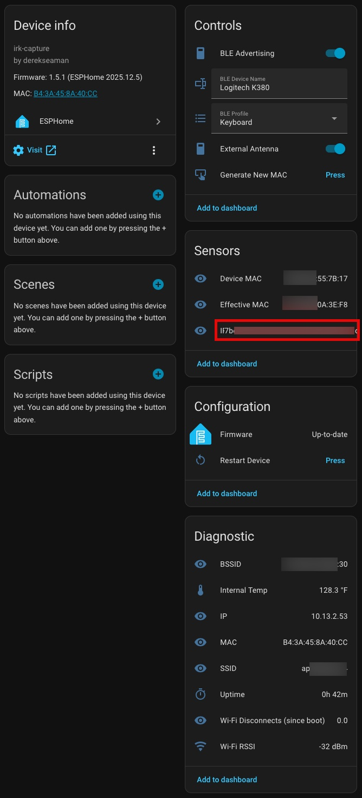
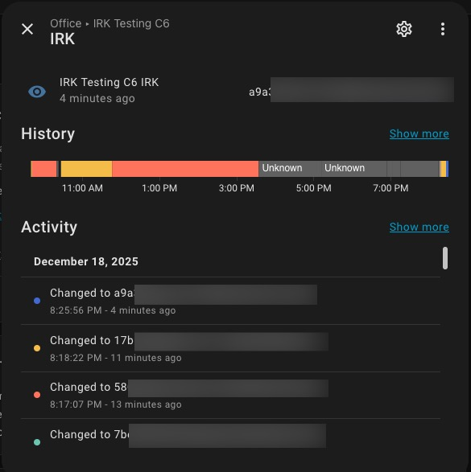

# IRK Capture for ESPHome


This ESPHome package will capture Apple and Android Bluetooth Identity Resolving Keys (IRK) using an ESP32 running ESPHome. Use the captured IRKs with the [Private BLE Device](https://www.home-assistant.io/integrations/private_ble_device/) integration in Home Assistant for reliable room-level presence detection. I use the [Bermuda BLE Trilateration](https://github.com/agittins/bermuda?tab=readme-ov-file) integration with IRKs for room-level presence detection.

> **⚠️ IMPORTANT:** This package **requires the ESP-IDF framework** and does **NOT** support the Arduino framework. The example YAML configurations include the required `framework: type: esp-idf` setting.

This package uses the ESP-IDF framework for broad ESP32 board compatibility. The ESP-IDF framework is required for ESP32-C2, ESP32-C5, ESP32-C6, ESP32-C61, ESP32-H2, and ESP32-P4 variants, as these newer ESP32 variants are not supported by the Arduino framework.

This ESPHome IRK capture package is only designed to capture IRKs and can NOT also act as a Bluetooth proxy. You can either flash this to a spare ESP32 device and keep it in a sock drawer when not being used, or temporarily flash this to an ESP32 then flash back to your generic Bluetooth proxy ESPHome configuration.

## What is a BLE IRK and Why Is It Needed?

Modern Apple and Android devices use **BLE privacy features** that randomize their MAC addresses periodically to prevent tracking. This creates a problem for ESPHome Bluetooth Proxy tracking in Home Assistant - your device appears as a different device every time its MAC address changes. This can happen as often as every 15 minutes.

The **Identity Resolving Key (IRK)** is a cryptographic key exchanged during BLE pairing that allows authorized devices to resolve these random MAC addresses back to the original device. By capturing a device's IRK, you can reliably track it for presence detection even as it randomizes its MAC address.

Capturing IRKs from devices can be very tricky, as the Bluetooth stack can very widely among OS versions and device vendors. Some devices may not play well with this package, or need pairing code tweaks to successfully capture the IRK. I have added a lot of debugging code which could help your favorite vibe coding LLM read the debug logs and provide suggested code changes.

The ESP32 uses a **random static address** for BLE advertising, which is regenerated each time the device boots. This address serves as both the advertised MAC address and the identity address for pairing. The "Generate New MAC" button also changes this address. However, if your phone or watch has previously paired with the ESP32, it may still have cached bond information. To ensure your device sees the ESP32 as completely new, either restart the ESP32 or use "Generate New MAC", and then **forget the pairing** on your phone/watch before attempting to pair again.

## Blog Post: Track Who's in Each Room with ESPHome + Bermuda BLE

For a complete guide for room-level presence detection using Bermuda BLE Trilateration with Home Assistant, check out my post: [Track Who's in Each Room with ESPHome + Bermuda BLE](https://www.derekseaman.com/2025/12/home-assistant-track-whos-in-each-room-with-esphome-bermuda-ble.html)

## What This Package Does

This IRK capture component turns your ESP32 into a BLE peripheral that can emulate different device types to capture IRKs from various platforms. It supports two BLE profiles:

- **Heart Sensor Profile** (for Apple devices, Android watches): Advertises as a heart rate monitor, which Apple devices and many Android watches can discover (with third party app)
- **Keyboard Profile** (for Android phones): Advertises as a "Logitech K380" keyboard, which bypasses Samsung's aggressive BLE filtering on Galaxy phones

When your Apple or Android device pairs with the ESP32:

1. The ESP32 presents itself as the selected BLE device type (heart rate sensor or keyboard)
2. Your device initiates a secure pairing process
3. During pairing, the device shares its IRK with the ESP32
4. The IRK is captured and exposed as a Home Assistant text sensor
5. You can then use this IRK with the Private BLE Device integration for presence tracking





## Requirements

- **ESP32 board** with Bluetooth support (any variant: ESP32, ESP32-C3, ESP32-C6, ESP32-S3, etc.)
- **ESP-IDF framework** (required - this component does NOT support Arduino framework)
- **ESPHome** 2024.x or newer - Tested with 2025.12
- **Home Assistant** (optional, but recommended for using the captured IRK with Private BLE Device integration)
- **ESPHome Device Builder** (optional, but makes managing ESPHome devices in Home Assistant easier)

## Installation

I cover three methods for deploying your ESPHome device:

- **Option 1 - Remote (Recommended):** Pulls the YAML and IRK Capture components directly from GitHub. Simplest method with no local file downloads required. This is the recommended option, as it will always pull the latest version at build time.
- **Option 2 - Local Package:** Uses a base YAML file plus a device-specific YAML file. Best for managing multiple ESP32 device types. Requires accessing the Home Assistant filesystem to manually copy files into the esphome directory tree.
- **Option 3 - Local Standalone:** A single self-contained YAML file with all configuration details. Only pulls the IRK Capture component from GitHub at build time.

If you use either the Seeed ESP32-C3 or Seeed ESP32-C6, I've built dedicated IRK capture YAML files. You can find those IRK YAML files in my repos: [ESPHome-Seeed-Xiao-ESP32-c3-Config](https://github.com/DerekSeaman/ESPHome-Seeed-Xiao-ESP32-c3-Config) and [ESPHome-Seeed-Xiao-ESP32-C6-Config](https://github.com/DerekSeaman/ESPHome-Seeed-Xiao-ESP32-C6-Config).

### Using ESPHome Device Builder Package - Remote (Option 1)

This is the simplest installation method. It pulls the component directly from GitHub without requiring any local file downloads.

1. Create a new dummy device in ESPHome, and save the unique API and OTA keys.
2. Delete all of the pre-populated YAML from the dummy device.
3. **Create your device YAML** using [irk-capture-device-remote.yaml](ESPHome%20Devices/irk-capture-device-remote.yaml) as a template and replace the OTA and API keys with the ones ESPHome generated.
   - Modify the YAML parameters `esp32_variant` and `esp32_board` as needed to match your ESP32 device and board type
   - Change the `device_name` and `friendly_name` as desired.

4. **Configure your secrets.yaml (Managed by ESPHome UI):**

   ```yaml
   wifi_ssid: "Your WiFi Network"
   wifi_password: "your_wifi_password"
   wifi_captive: "fallback_password"
   ```

5. **Flash to your ESP32:**
   - In ESPHome, click "Install" and choose your connection method
   - IMPORTANT: After the flashing is complete, either power cycle your ESP32 or do a 'Restart Device' from the ESPHome interface. This will randomize the BLE MAC address.

### Using ESPHome Device Builder Package - Local (Option 2)

1. **In the Home Assistant filesystem create the 'common' directory under esphome, if not already present:**

   ```text
   /config/esphome/
   ├── common/
   │   └── irk-capture-base.yaml
   └── your-device-name.yaml
   ```

2. **Copy the base configuration:**
   - Download [irk-capture-base.yaml](ESPHome%20Devices/irk-capture-base.yaml) from this repository
   - Place it in `/config/esphome/common/` on your Home Assistant installation

3. **Create your device YAML:**
   - Create a new dummy device in ESPHome, and save the unique API and OTA keys.
   - Delete all of the pre-populated YAML from the dummy device.
   - Paste the [irk-capture-device.yaml](ESPHome%20Devices/irk-capture-device.yaml) contents into the ESPHome device builder and replace the OTA and API keys with the ones ESPHome generated.
   - Modify the YAML parameters `esp32_variant` and `esp32_board` as needed to match your ESP32 device and board type
   - Change the `device_name` and `friendly_name` as desired.
   - You should only modify the substitutions shown below:

   ```yaml
   substitutions:
     device_name: esphome-irk-capture          # Change: Unique name for your device (lowercase, hyphens only)
     friendly_name: IRK Capture                # Change: Human-readable name shown in Home Assistant
     api_key: "ZmFrZWFwaWtleWZha2VleGFtcGxlZmFrZWtleQ=="  # Change: Generated with ESPHome new device wizard
     ota_password: "ChangeMe!2025"             # Change: Generated with the ESPHome new device wizard
     esp32_variant: esp32c3                    # Change: Your ESP32 variant (esp32, esp32c3, esp32c6, esp32s3, etc.)
     esp32_board: seeed_xiao_esp32c3           # Change: Your board type (see ESPHome board list)
     ble_name: "IRK Capture"                   # Change: BLE advertising name (max 12 characters, shown in Bluetooth settings)
   ```

4. **Secrets File** (managed by ESPHome device builder):
   - Modify the Wi-Fi secrets as needed

   ```yaml
   wifi_ssid: "Your WiFi Network"
   wifi_password: "your_wifi_password"
   wifi_captive: "fallback_password"
   ```

5. **Flash to your ESP32:**
   - In ESPHome Device Builder, click "Install" and choose your connection method
   - IMPORTANT: After the flashing is complete, either power cycle your ESP32 or do a 'Restart Device' from the ESPHome interface. This will randomize the BLE MAC address.

### Using a Standalone ESPHome Device - Local (Option 3)

1. Create a new dummy device in ESPHome, and save the unique API and OTA keys.
2. Delete all of the pre-populated YAML from the dummy device.
3. Copy the contents of the [irk-capture-full.yaml](https://github.com/DerekSeaman/irk-capture/blob/main/ESPHome%20Devices/irk-capture-full.yaml) into the ESPHome device builder and replace the OTA and API keys with the ones ESPHome generated.
4. Modify the YAML parameters `esp32_variant` and `esp32_board` as needed to match your ESP32 device and board type.
5. Change the `device_name` and `friendly_name` as desired.
6. You should only modify the substitutions shown below:

   ```yaml
   substitutions:
     device_name: esphome-irk-capture          # Change: Unique name for your device (lowercase, hyphens only)
     friendly_name: IRK Capture                # Change: Human-readable name shown in Home Assistant
     api_key: "ZmFrZWFwaWtleWZha2VleGFtcGxlZmFrZWtleQ=="  # Change: Generated with ESPHome new device wizard
     ota_password: "ChangeMe!2025"             # Change: Generated with the ESPHome new device wizard
     esp32_variant: esp32c3                    # Change: Your ESP32 variant (esp32, esp32c3, esp32c6, esp32s3, etc.)
     esp32_board: seeed_xiao_esp32c3           # Change: Your board type (see ESPHome board list)
     ble_name: "IRK Capture"                   # Change: BLE advertising name (max 12 characters, shown in Bluetooth settings)
   ```

7. **Secrets File** (managed by ESPHome device builder):
   - Modify the Wi-Fi secrets as needed

   ```yaml
   wifi_ssid: "Your WiFi Network"
   wifi_password: "your_wifi_password"
   wifi_captive: "fallback_password"
   ```

8. **Flash to your ESP32:**
   - In ESPHome Device Builder, click "Install" and choose your connection method
   - IMPORTANT: After the flashing is complete, either power cycle your ESP32 or do a 'Restart Device' from the ESPHome interface. This will randomize the BLE MAC address.

### Optional Configuration Parameters (Not recommended to change)

You can modify these parameters in your device YAML configuration to control multi-device capture behavior:

```yaml
irk_capture:
  id: irk
  start_on_boot: true
  continuous_mode: true   # Optional: Keep advertising after IRK capture (default: true)
  max_captures: 10        # Optional: Maximum IRKs to capture before auto-stop (default: 10, 0=unlimited)
```

**Configuration Options:**

- **`continuous_mode`** (default: `true`):
  - `true`: Keeps advertising after IRK capture to allow multiple device pairing
  - `false`: Stops advertising after capturing one IRK (single-device mode)

- **`max_captures`** (default: `10`):
  - `1-255`: Capture up to N IRKs before auto-stopping
  - `0`: Unlimited captures (not recommended for production)

**Important Notes:**

- If `continuous_mode: false` and `max_captures > 1`, ESPHome will reject the configuration (conflict)
- For single-device capture, set `continuous_mode: false` and `max_captures: 1`
- After capturing multiple IRKs, restart your ESP32 device between captures to avoid pairing conflicts

## Home Assistant Entities

After flashing and connecting to Home Assistant, the following entities will be available:

| Entity | Type | Description |
| :--- | :--- | :--- |
| **BLE Advertising** | Switch | Turn Bluetooth advertising on/off (starts ON by default) |
| **BLE Device Name** | Text Input | Change the advertised Bluetooth name (default: "IRK Capture") |
| **BLE Profile** | Select | Choose BLE advertising profile: "Heart Sensor" (Apple) or "Keyboard" (Android). Changing profiles triggers a reboot. |
| **Generate New MAC** | Button | Generate a new random MAC address for the ESP32 |
| **Device MAC** | Text Sensor | Bluetooth MAC address of the last paired device |
| **Effective MAC** | Text Sensor | Current BLE MAC address being advertised by the ESP32 |
| **IRK** | Text Sensor | The captured IRK in format `xxxxxxxxxxxxxxxxxxxxxxxxxxxxxxxx` |
| **Restart Device** | Button | Restart the ESP32 - Clears all pairing information |
| **BSSID** | Text Sensor | Wi-Fi access point BSSID (diagnostic) |
| **Internal Temp** | Sensor | ESP32 internal temperature (diagnostic) |
| **IP** | Text Sensor | Device IP address (diagnostic) |
| **MAC** | Text Sensor | ESP32 Wi-Fi MAC address (diagnostic) |
| **SSID** | Text Sensor | Connected Wi-Fi network name (diagnostic) |
| **Uptime** | Sensor | Device uptime (diagnostic) |
| **Wi-Fi Disconnects (since boot)** | Sensor | Number of Wi-Fi disconnections since boot (diagnostic) |
| **Wi-Fi RSSI** | Sensor | Wi-Fi signal strength in dBm (diagnostic) |

## Tested Devices

This ESPHome IRK capture component has been successfully tested with:

- **Apple OS 26 family:**
  - iPhone
  - Apple Watch
  - iPad

- **Android devices:**
  - Samsung Galaxy S25+
  - Samsung Galaxy Watch7
  - Google Pixel 9
  - Jailbroken Amazon Echo Show 5 with LineageOS 18.1

## Usage Instructions

### Getting Started

1. **Enable BLE advertising:**
   - In Home Assistant, open ESPHome and find your IRK Capture device
   - Power on your ESP32 board with the IRK Capture build
   - Optional, but recommended, open the real time logs for your ESP32 device

2. **Select the appropriate BLE Profile:**
   - For **Apple devices** (iPhone, iPad, Apple Watch): Select **"Heart Sensor"** profile
   - For **Android phones** (Samsung, Pixel, etc.): Select **"Keyboard"** profile
   - For **Android watches**: Select **"Heart Sensor"** profile and then follow the instructions below to enable discovering of the heart rate sensor via a third party app from the Play store

   - **Note:** Changing profiles will automatically reboot the ESP32 to apply the new GATT services. Wait approximately 30 seconds after the reboot before attempting to pair. If you are viewing logs wirelessly in ESPHome, you may need to reconnect to the ESP32 after the reboot to see current logs. When the Effective MAC sensor updates with a new address, the device is ready to capture IRKs.

### Capturing an IRK from Apple Devices

1. **Ensure the "Heart Sensor" profile is selected** in the BLE Profile dropdown on the ESPHome device page

2. **Open Bluetooth settings** on your Apple device

3. **Look for the advertised device:**
   - Default name: "IRK Capture" (or whatever you set as `ble_name`)
   - It will appear under available devices - See troubleshooting section if it's not listed

4. **Tap on the device name to pair:**
   - If prompted, tap "Pair" or "Connect"
   - No PIN is required for this pairing
   - Depending on the device/OS, pairing may not complete or show as not connected. This can be normal.

5. **View the captured IRK:**
   - **Option 1:** Check the ESP32 logs in ESPHome Device Builder
   - **Option 2:** View the "IRK" text sensor in Home Assistant (on your IRK Capture device page)
   - The IRK will be in format: `xxxxxxxxxxxxxxxxxxxxxxxxxxxxxxxx`

6. **Forget the pairing (important):**
   - After successfully capturing the IRK, go to your device's Bluetooth settings
   - Forget or unpair the "IRK Capture" device (or whatever name you used)
   - This prevents your device from automatically reconnecting and allows the ESP32 to capture IRKs from other devices
   - If you need to capture IRKs from multiple devices, I suggest a 'Restart Device' (or full power cycle of your ESP32) between each capture to avoid potential issues

### Capturing an IRK from Android Phones

1. **Ensure the "Keyboard" profile is selected** in the BLE Profile dropdown on the ESPHome device page
   - The ESP32 will reboot to apply the new GATT services
   - After reboot, the BLE Device Name will be "Logitech K380" and a new MAC address will be generated

2. **Open Bluetooth settings** on your Android device

3. **Look for "Logitech K380"** under Available Devices
   - If you don't see it, see the Troubleshooting section for Samsung One UI 7 devices

4. **Tap on "Logitech K380" to pair:**
   - If prompted, tap "Pair"
   - No PIN is required for this pairing

5. **View the captured IRK:**
   - **Option 1:** Check the ESP32 logs in ESPHome Device Builder
   - **Option 2:** View the "IRK" text sensor in Home Assistant (on your IRK Capture device page)
   - The IRK will be in format: `xxxxxxxxxxxxxxxxxxxxxxxxxxxxxxxx`

6. **Forget the pairing (important):**
   - After successfully capturing the IRK, go to your device's Bluetooth settings
   - Forget or unpair the "Logitech K380" device
   - This prevents your device from automatically reconnecting and allows the ESP32 to capture IRKs from other devices
   - If you need to capture IRKs from multiple devices, I suggest a 'Restart Device' (or full power cycle of your ESP32) between each capture to avoid potential issues

### Capturing an IRK from Android Watches

1. **Install the app "[Gear Tracker II](https://play.google.com/store/apps/details?id=com.limegreenv.geartracker)"** on your Android watch

2. **Ensure the "Heart Sensor" profile is selected** in the BLE Profile dropdown on the ESPHome device page

3. **Open the Gear Tracker II app** on your watch and pair to the advertised ESP32 device name

4. **Tap on the device name to pair:**
   - If prompted, tap "Pair" or "Connect"
   - No PIN is required for this pairing
   - Depending on the device/OS, pairing may not complete or show as not connected. This can be normal.

5. **View the captured IRK:**
   - **Option 1:** Check the ESP32 logs in ESPHome Device Builder
   - **Option 2:** View the "IRK" text sensor in Home Assistant (on your IRK Capture device page)
   - The IRK will be in format: `xxxxxxxxxxxxxxxxxxxxxxxxxxxxxxxx`

6. **Forget the pairing (important):**
   - After successfully capturing the IRK, go to your device's Bluetooth settings
   - Forget or unpair the "IRK Capture" device (or whatever name you used)
   - This prevents your device from automatically reconnecting and allows the ESP32 to capture IRKs from other devices
   - If you need to capture IRKs from multiple devices, I suggest a 'Restart Device' (or full power cycle of your ESP32) between each capture to avoid potential issues

### Installing Private BLE Device Integration

In order to use the captured IRKs with Home Assistant, you need to install the Private BLE integration. This will let you paste your IRKs into the integration and will enable tracking of the 'random' Bluetooth MAC addresses.

1. **Go to Home Assistant:**
   - Navigate to Settings → Devices & Services

2. **Add the Private BLE Device integration:**
   - Click "+ ADD INTEGRATION"
   - Search for "Private BLE Device"
   - Click to add

3. **Enter the captured IRK:**
   - Paste the complete IRK string
   - Example: `a1b2c3d4e5f6a7b8c9d0e1f2a3b4c5d6`

4. **Complete setup:**
   - Give the device a friendly name (e.g., "Derek's iPhone")
   - The device will now be tracked for presence detection

## Troubleshooting Tips

### ESP32 Device Name Not Appearing in Bluetooth Settings

- **Turn off Bluetooth** on your device
- Press the **"Restart Device"** button to reset the ESP32's BLE stack
- Ensure the **"BLE Advertising"** switch is ON
- Turn your device's Bluetooth back on and connect to the ESP32
- If ESP32 device does not appear on Android, see the section below

### Android Phone can't see ESP32 Device Name

Samsung One UI 7 (Galaxy S25, S24, etc.) aggressively filters BLE devices in Bluetooth settings. To restore visibility:

1. **Enable Developer Options**: Settings → About Phone → Software Information → Tap "Build Number" 7 times
2. **Enable BLE visibility**: Settings → Developer Options → Scroll down and enable **"Show unsupported Bluetooth LE devices in Bluetooth settings"**
3. Return to Bluetooth settings and scan again — the ESP32 device should now appear
4. Tap on the device (e.g., "Logitech K380" when using Keyboard profile) and tap pair. The IRK should appear in the ESP32 logs and ESPHome device page in Home Assistant

### Android Phone still not visible after Developer Options fix

If the Developer Options fix doesn't work, or you're on a non-Samsung Android device with similar filtering, try using the nRF Connect app:

1. Install **nRF Connect** from the Play Store (by Nordic Semiconductor)
2. Open the app and tap "Scan"
3. Look for "Logitech K380" in the device list (when using Keyboard profile)
4. Tap on it to connect
5. The pairing dialog should appear, allowing the bonding process to complete
6. Look for the captured IRK in the ESP32 logs or the ESPHome device page

### Android Watches

Many Android watches aggressively filter BLE devices, and by default neither the keyboard or heart sensor will be shown as a pairable device. However, the app "Gear Tracker II" (no affiliation) overcomes this aggressive BLE filtering and should allow you pair your watch to the ESP32 and extract the IRK.

Watches that require "reverse" pairing (i.e. the watch advertises as a device that needs to be paired with) will NOT work with this package. This package requires your watch pair TO the ESP32, not the other way around.

### IRK Not Captured After Pairing

- After pairing, **forget/unpair the BLE device** from your device's Bluetooth settings
- Turn Bluetooth OFF on your device
- Modify the BLE Device Name on the ESPHome device page
- Turn Bluetooth ON on your device
- Try pairing to the ESP32 again
- If that still fails, power cycle your phone/watch/tablet, power cycle your ESP32, change the BLE Device Name, and try pairing again

### ESPHome Build Fails

- Clean the build folder and retry
- Ensure you're using ESPHome 2024.x or newer (tested with ESPHome 2025.12)
- Verify your `esp32_variant` and `esp32_board` substitutions match your hardware
- Check that all required secrets are defined in `secrets.yaml`

### Advanced Troubleshooting

- For additional troubleshooting logs, connect to your ESP32 device and view the logs during a capture session.
- To enable DEBUG level logging, add this to your ESPHome YAML:

  ```yaml
  logger:
    level: DEBUG
    logs:
      irk_capture: DEBUG
  ```

  DEBUG logging covers:
  - **Connection Details** - Peer addresses, connection parameters (interval, latency, supervision timeout), role info
  - **GAP Events** - State transitions, unhandled event types
  - **Bond/IRK Status** - Whether bonds exist, IRK availability in NVS store
  - **Deduplication** - When duplicate IRKs are suppressed, cache management (eviction, additions)
  - **GATT Operations** - DevInfo reads, characteristic handles
  - **Advertising State** - Start/stop, device name being advertised
  - **MAC Rotation** - Pre-generated MAC values, state machine transitions
  - **Security/Pairing** - Bond security flags, peer identity resolution, security retry status
  - **Timer Operations** - Post-disconnect and late encryption timer checks
  - **Heart Rate Notifications** - Notify return codes

### ESPHome Log Sample

Below is a sample log showing a successful IRK capture:

```text
[16:15:01.812][D][switch:065]: 'BLE Advertising': Sending state ON
[16:15:01.814][D][irk_capture:1690]: Advertising as 'IRK Cap' (Heart Rate Sensor)
[16:15:01.861][D][sensor:135]: 'Wi‑Fi RSSI': Sending state -30.00000 dBm with 0 decimals of accuracy
[16:15:16.669][I][irk_capture:866][nimble_host]: Connection established successfully
[16:15:16.669][I][irk_capture:1832][nimble_host]: Conn start: handle=0 enc_ready=0 adv=1
[16:15:16.669][I][irk_capture:1835][nimble_host]: Connected; handle=0, initiating security
[16:15:16.669][I][irk_capture:362][nimble_host]: sec: enc=0 bonded=0 auth=0 key_size=0
[16:15:16.669][I][irk_capture:366][nimble_host]: peer ota=4A:1B:2C:3D:4E:5F type=1
[16:15:16.669][I][irk_capture:368][nimble_host]: peer id =A1:B2:C3:D4:E5:F6 type=0
[16:15:16.669][D][irk_capture:372][nimble_host]: conn params: interval=24 latency=0 supervision_timeout=500
[16:15:16.672][D][irk_capture:376][nimble_host]: role=slave our_ota=C0:FF:EE:12:34:56
[16:15:16.685][D][irk_capture:1856][nimble_host]: Peer unbonded and no cached bond (ENOENT) - will pair fresh
[16:15:18.724][I][irk_capture:2105]: Retrying security initiate after 2050 ms
[16:15:18.727][W][irk_capture:2107]: Retry security initiate rc=2
[16:15:19.121][D][irk_capture:1195][nimble_host]: Peer identity resolved using IRK
[16:15:19.121][I][irk_capture:988][nimble_host]: ENC_CHANGE status=0 (0x00)
[16:15:19.121][I][irk_capture:1045][nimble_host]: Encryption established; attempting immediate IRK capture
[16:15:19.121][I][irk_capture:522][nimble_host]: Re-publishing IRK (capture #2/5)
[16:15:19.121][I][irk_capture:425][nimble_host]:
[16:15:19.121][I][irk_capture:428][nimble_host]: *** IRK CAPTURED *** (ENC_CHANGE)
[16:15:19.121][I][irk_capture:607][nimble_host]: Identity Address: A1:B2:C3:D4:E5:F6
[16:15:19.121][I][irk_capture:608][nimble_host]: IRK: a1b2c3d4e5f6a7b8c9d0e1f2a3b4c5d6
[16:15:19.121][I][irk_capture:609][nimble_host]: Total captures this session: 2
[16:15:19.121][I][irk_capture:425][nimble_host]:
[16:15:19.211][I][irk_capture:893][nimble_host]: Disconnect reason=534 (0x216)
[16:15:19.211][I][irk_capture:1932][nimble_host]: Disconnected
```

## Credits

Based on [ESPresense](https://github.com/ESPresense/ESPresense) enrollment functionality.

Original package: [github://KyleTeal/irk-capture/irk-capture-package.yaml@main](https://github.com/KyleTeal/irk-capture)

## License

MIT License - See LICENSE file for details
