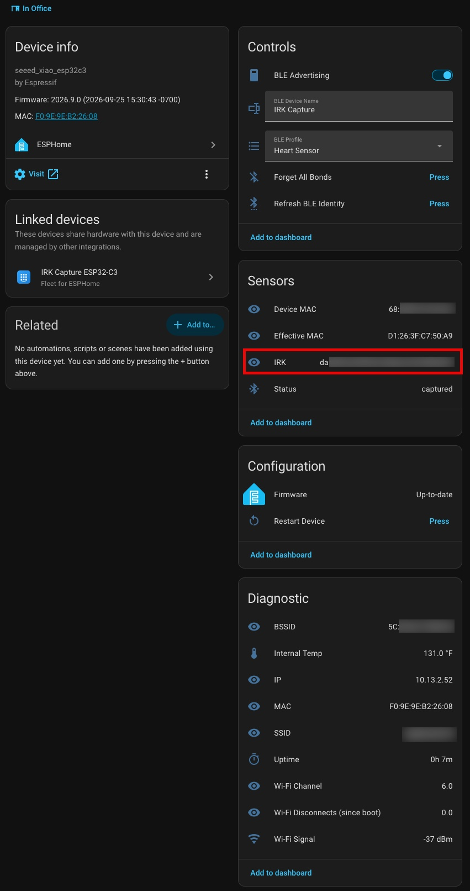
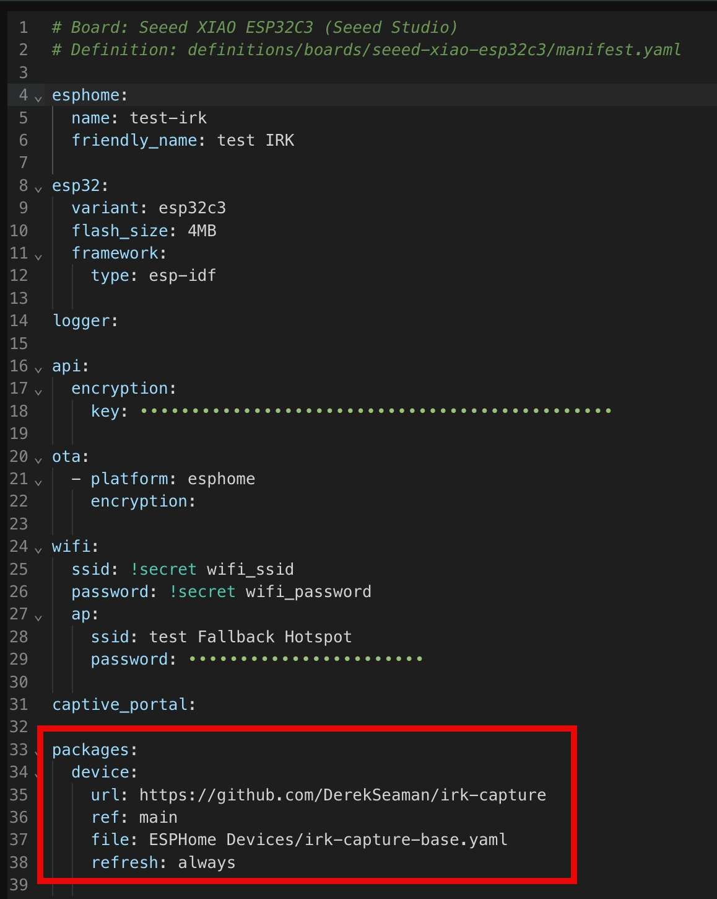
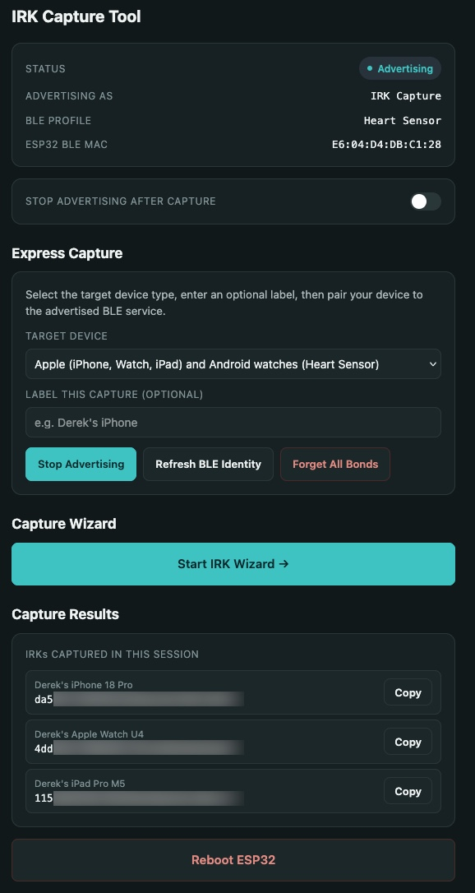
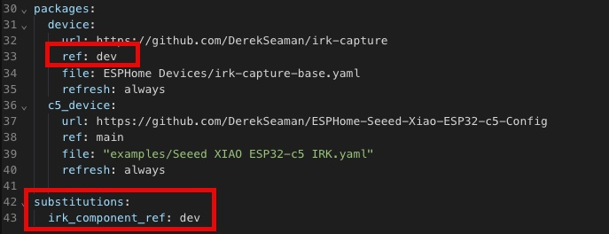

# IRK Capture for ESPHome

 [](https://buymeacoffee.com/vdereks)

This ESPHome package will capture Apple and Android Bluetooth Identity Resolving Keys (IRK) using an ESP32 running ESPHome. Use the captured IRKs with the [Private BLE Device](https://www.home-assistant.io/integrations/private_ble_device/) integration in Home Assistant for reliable room-level presence detection. I use the [Bermuda BLE Trilateration](https://github.com/agittins/bermuda?tab=readme-ov-file) integration with IRKs for room-level presence detection.

You can capture IRKs through two interfaces: the ESP32's ESPHome device page in Home Assistant, or an optional standalone web wizard served by the ESP32. The wizard guides you through the capture process in your browser without needing Home Assistant. See [Optional: The Capture Wizard Package](#optional-the-capture-wizard-package) later in this README for setup instructions.

This ESPHome IRK capture package is only designed to capture IRKs and can NOT pull double duty as a Bluetooth proxy. You can either flash this to a spare ESP32 device and keep it in a sock drawer when not being used, or temporarily flash this package to an ESP32 then flash back to your generic Bluetooth proxy ESPHome configuration. IRKs are generally permanent and do not change over time.

## What is a BLE IRK and Why Is It Needed?

Modern Apple and Android devices use **BLE privacy features** that randomize their MAC addresses periodically to prevent tracking. This creates a problem for ESPHome Bluetooth Proxy tracking in Home Assistant - your device appears as a different device every time its MAC address changes. This can happen as often as every 15 minutes.

The **Identity Resolving Key (IRK)** is a cryptographic key exchanged during BLE pairing that allows authorized devices to resolve these random MAC addresses back to the original device. By capturing a device's IRK, you can reliably track it for presence detection even as it randomizes its MAC address.

Capturing IRKs from devices can be very tricky, as the Bluetooth stack can vary widely among OS versions and device vendors. Some devices may not play well with this package, or need pairing code tweaks to successfully capture the IRK. I have added a lot of debugging code which could help your favorite vibe coding LLM read the debug logs and provide suggested code changes.

## Track Who's in Each Room with ESPHome + Bermuda BLE

For a complete guide for room-level presence detection using Bermuda BLE Trilateration with Home Assistant, check out my post: [Track Who's in Each Room with ESPHome + Bermuda BLE](https://www.derekseaman.com/2025/12/home-assistant-track-whos-in-each-room-with-esphome-bermuda-ble.html)

## BLE Identity

The ESP32's BLE identity is the name and MAC address your phone or watch sees when it looks for devices to pair with. After every boot, the ESP32 advertises under the default name for the selected profile:

| Profile | Default name |
| :--- | :--- |
| Heart Sensor | `IRK Capture` |
| Keyboard | `Logitech K380` |

The MAC address is a **random static address** that is regenerated each time the ESP32 boots. The current address is shown in the **ESP32 BLE MAC** sensor.

**Refresh BLE Identity.** Pressing this button gives the ESP32 a new MAC address and a matching new name, without a reboot. The name shows the active profile, followed by the last four characters of the new MAC address:

| Profile | Name after a refresh |
| :--- | :--- |
| Heart Sensor | `IRK HR 7F3A` |
| Keyboard | `IRK KB 7F3A` |

The name changes along with the address because devices may hide an accessory whose name they've already seen, even on a new MAC address. If the ESP32 doesn't show up on your phone or watch, turn Bluetooth off and back on there. Because the suffix matches the end of ESP32 BLE MAC, you can tell which entry on your phone is the current one.

**Custom names.** You can also change the advertising name yourself, in either profile. Type a new name into **BLE Device Name** and press Enter, and the ESP32 starts advertising it immediately. Custom names are limited to 12 characters; letters, numbers, spaces, `-` and `_` are kept and anything else is removed. In Keyboard mode, you can also enter the exact default `Logitech K380` to restore it. Saving the current name leaves an active pairing connected.

**After a reboot**, whether from Restart Device, a power cycle, or changing the BLE profile, the ESP32 goes back to the default name for its profile and a new random MAC address. A refreshed or custom name only lasts until then.

If your phone or watch has paired with the ESP32 before, **forget the pairing** on it before pairing again.

## What This Package Does

This IRK capture component turns your ESP32 into a BLE peripheral that can emulate different device types to capture IRKs from various platforms. It supports two BLE profiles:

- **Heart Sensor Profile** (for Apple devices, Android watches, GrapheneOS): Advertises as a heart rate monitor, which Apple devices and many Android watches can discover (may need third party Android watch app)
- **Keyboard Profile** (for Android phones): Advertises as a "Logitech K380" keyboard by default, which bypasses Samsung's aggressive BLE filtering on Galaxy phones

When your Apple or Android device pairs with the ESP32:

1. The ESP32 presents itself as the selected BLE device type (heart rate sensor or keyboard)
2. Your device initiates a secure pairing process
3. During pairing, the device shares its IRK with the ESP32
4. The IRK is captured and exposed as a Home Assistant text sensor
5. You can then use this IRK with the Private BLE Device integration for presence tracking



## Requirements

- **ESP32 board** with Bluetooth support (any variant: ESP32, ESP32-C3, ESP32-C6, ESP32-S3, etc.)
- **ESP-IDF framework** (required - this component does NOT support Arduino framework)
- **ESPHome** 2026.7 or newer - Tested with 2026.9.0
- **Home Assistant** (optional, but recommended for using the captured IRK with Private BLE Device integration)
- **ESPHome Device Builder** (optional, but makes managing ESPHome devices in Home Assistant easier)

## Installation Instructions

I’ve written a detailed blog post that covers the installation and usage of ESPHome Device Builder. It shows you how to build a device profile for your ESP32 and capture your device IRKs. You can find it here:
[How-To: Using my ESPHome Bluetooth IRK Capture Package](https://www.derekseaman.com/2026/01/how-to-using-my-bluetooth-irk-capture-package.html)

The super abbreviated installation instructions are as follows:

- Build a new ESPHome device specific to your ESP32 board
- Add the shown **packages:** section at the bottom
- Connect your ESP32 device and flash it

ESPHome Device Builder pulls the package and component from the `main` branch, so clean builds always get the latest version.



Here's the same thing as plain, copyable YAML — a generic ESPHome Device Builder device with the **packages:** section added at the bottom (replace the placeholder key/passwords with your own device's values):

```yaml
# Board: Seeed XIAO ESP32C3 (Seeed Studio)
# Definition: definitions/boards/seeed-xiao-esp32c3/manifest.yaml

esphome:
  name: test-irk
  friendly_name: test IRK

esp32:
  variant: esp32c3
  flash_size: 4MB
  framework:
    type: esp-idf

logger:

api:
  encryption:
    key: "UkVQTEFDRS1XSVRILVlPVVItT1dOLTMyQi1LRVkhISE="

ota:
  - platform: esphome
    encryption:

wifi:
  ssid: !secret wifi_ssid
  password: !secret wifi_password
  ap:
    ssid: test Fallback Hotspot
    password: "CHANGE_ME_AP_PASSWORD"

captive_portal:

packages:
  device:
    url: https://github.com/DerekSeaman/irk-capture
    ref: main
    file: ESPHome Devices/irk-capture-base.yaml
    refresh: always
```

You can find the **packages:** content here: [irk-capture-device-remote.yaml](https://github.com/DerekSeaman/irk-capture/blob/main/ESPHome%20Devices/irk-capture-device-remote.yaml)

If you're using a Seeed Studio XIAO ESP32 board, add the board-specific hardware
and diagnostics package as a second `packages:` entry alongside the one above:

- **XIAO ESP32-C3**: [repo](https://github.com/DerekSeaman/ESPHome-Seeed-Xiao-ESP32-c3-Config) — [Seeed XIAO ESP32-c3 IRK.yaml](https://github.com/DerekSeaman/ESPHome-Seeed-Xiao-ESP32-c3-Config/blob/main/examples/Seeed%20XIAO%20ESP32-c3%20IRK.yaml)
- **XIAO ESP32-C5**: [repo](https://github.com/DerekSeaman/ESPHome-Seeed-Xiao-ESP32-c5-Config) — [Seeed XIAO ESP32-c5 IRK.yaml](https://github.com/DerekSeaman/ESPHome-Seeed-Xiao-ESP32-c5-Config/blob/main/examples/Seeed%20XIAO%20ESP32-c5%20IRK.yaml)
- **XIAO ESP32-C6**: [repo](https://github.com/DerekSeaman/ESPHome-Seeed-Xiao-ESP32-C6-Config) — [Seeed XIAO ESP32-c6 IRK.yaml](https://github.com/DerekSeaman/ESPHome-Seeed-Xiao-ESP32-C6-Config/blob/main/examples/Seeed%20XIAO%20ESP32-c6%20IRK.yaml)
- **XIAO ESP32-S3**: [repo](https://github.com/DerekSeaman/ESPHome-Seeed-Xiao-ESP32-s3-Config) — [Seeed XIAO ESP32-s3 IRK.yaml](https://github.com/DerekSeaman/ESPHome-Seeed-Xiao-ESP32-s3-Config/blob/main/examples/Seeed%20XIAO%20ESP32-s3%20IRK.yaml)

### Full Example: Seeed XIAO ESP32-C3

Here's a complete device YAML for the Seeed XIAO ESP32-C3, combining the generic device config above with **both** `packages:` entries — the main IRK Capture package and the C3-specific hardware/diagnostics package (replace the placeholder key/passwords with your own device's values):

```yaml
# Board: Seeed XIAO ESP32C3 (Seeed Studio)
# Definition: definitions/boards/seeed-xiao-esp32c3/manifest.yaml

esphome:
  name: test-irk
  friendly_name: test IRK

esp32:
  variant: esp32c3
  flash_size: 4MB
  framework:
    type: esp-idf

logger:

api:
  encryption:
    key: "UkVQTEFDRS1XSVRILVlPVVItT1dOLTMyQi1LRVkhISE="

ota:
  - platform: esphome
    encryption:

wifi:
  ssid: !secret wifi_ssid
  password: !secret wifi_password
  ap:
    ssid: test Fallback Hotspot
    password: "CHANGE_ME_AP_PASSWORD"

captive_portal:

packages:
  device:
    url: https://github.com/DerekSeaman/irk-capture
    ref: main
    file: ESPHome Devices/irk-capture-base.yaml
    refresh: always
  c3_hardware:
    url: https://github.com/DerekSeaman/ESPHome-Seeed-Xiao-ESP32-c3-Config
    ref: main
    file: examples/Seeed XIAO ESP32-c3 IRK.yaml
    refresh: always
```

## Usage Instructions

Again, my [blog post](https://www.derekseaman.com/2026/01/how-to-using-my-bluetooth-irk-capture-package.html) covers usage in detail. However, the super short version is as follows:

- In Home Assistant go to Settings > ESPHome -> Your ESP32 IRK Capture Device
- Select the appropriate BLE profile (Heart Sensor for Apple devices and Android watches, Keyboard for Android phones)
- Pair your phone or watch with the advertising ESP32 device name shown in **BLE Device Name** (may need to toggle Bluetooth off/on to see the ESP32 device)
- If the ESP32 doesn't appear, press **Refresh BLE Identity** to give it a new name and MAC address. Your phone may briefly list older names too; pair with the one that matches BLE Device Name
- Watch the Sensors IRK value and it should display the captured IRK
- Paste the captured IRK into the Private BLE Device integration in Home Assistant

## Home Assistant Entities

After flashing and connecting to Home Assistant, the following entities will be available:

| Entity | Type | Description |
| :--- | :--- | :--- |
| **BLE Advertising** | Switch | Keep Bluetooth advertising enabled between connections (starts ON by default) |
| **BLE Device Name** | Text Input | Change the advertised name until the next reboot (defaults: "IRK Capture" for Heart Sensor, "Logitech K380" for Keyboard). Refresh BLE Identity writes a generated name here |
| **BLE Profile** | Select | Choose BLE advertising profile: "Heart Sensor" (Apple devices and Android watches) or "Keyboard" (Android phones). Changing profiles triggers a reboot. |
| **Refresh BLE Identity** | Button | Rotate the advertised address and rename the device to match it (`IRK HR 7F3A` or `IRK KB 7F3A`) until the next reboot, so a device that cached the old name sees a new accessory |
| **Device BLE MAC** | Text Sensor | Bluetooth MAC address of the last paired device |
| **ESP32 BLE MAC** | Text Sensor | Current Bluetooth MAC address being advertised by the ESP32 |
| **IRK** | Text Sensor | Latest completed pairing result: a captured IRK or `Failed: IRK not used` |
| **Status** | Text Sensor | Current session state: `idle`, `advertising`, `pairing`, `capturing`, `captured`, or `no_irk` |
| **Restart Device** | Button | Restart the ESP32 - Clears all pairing information and restores the default BLE name |
| **BSSID** | Text Sensor | Wi-Fi access point BSSID (diagnostic) |
| **Internal Temp** | Sensor | ESP32 internal temperature (diagnostic) |
| **IP** | Text Sensor | Device IP address (diagnostic) |
| **MAC** | Text Sensor | ESP32 Wi-Fi MAC address (diagnostic) |
| **SSID** | Text Sensor | Connected Wi-Fi network name (diagnostic) |
| **Uptime** | Sensor | Device uptime (diagnostic) |
| **Wi-Fi Disconnects (since boot)** | Sensor | Number of Wi-Fi disconnections since boot (diagnostic) |
| **Wi-Fi Signal** | Sensor | Wi-Fi signal strength in dBm (diagnostic) |

**BLE Advertising switch.** This switch controls whether the ESP32 advertises so devices can find it. It's ON after every boot by default. While a device is connected, the ESP32 pauses advertising but the switch stays ON, and advertising resumes when the device disconnects.

If advertising fails to start, the ESP32 keeps retrying on its own, quickly at first and then once a minute, for as long as the switch is ON. It doesn't reboot or lose your captures while it does. Turning the switch off stops the retries, and turning it back on tries again right away.

*Advanced:* to have advertising start OFF, add `start_on_boot: false` under `irk_capture:` in your device YAML. Setting a `restore_mode` on the switch itself overrides this.

### Status and building a capture flow on top of it

**Status** reports where a capture attempt is, which is otherwise only inferable by watching several entities change at once:

| State | Meaning |
| :--- | :--- |
| `idle` | No active capture work or advertising; a completed connection may still be closing |
| `advertising` | Advertising, nothing connected |
| `pairing` | A peer is connected, security is not yet complete |
| `capturing` | Encrypted, reading the identity key from the bond store |
| `captured` | A key was just captured (or the device was deliberately re-paired) |
| `no_irk` | Pairing completed but the peer sent no identity key - see the IRK sensor |

`captured` and `no_irk` stay on screen for a few seconds so you don't miss them. A device you already captured that reconnects in the background won't replace the result you're looking at.

## Optional: The Capture Wizard Package

As an alternative interface, you can add an optional wizard package that uses a web page served by your ESP32 to guide you through capturing an IRK. The `irk-capture-wizard.yaml` package runs alongside the standard ESPHome web interface on a separate port (8080 by default). You can use it directly from your browser without Home Assistant, a dashboard, or an internet connection—even when connected to the ESP32's fallback Wi-Fi access point.



Most people capture straight from the ESPHome device page in Home Assistant and won’t need to use this wizard mode. It is completely optional. It is off unless you add it, as a second `packages:` entry:

```yaml
packages:
  device:
    url: https://github.com/DerekSeaman/irk-capture
    ref: main
    file: ESPHome Devices/irk-capture-base.yaml
    refresh: always
  wizard:
    url: https://github.com/DerekSeaman/irk-capture
    ref: main
    file: ESPHome Devices/irk-capture-wizard.yaml
    refresh: always
```

Add `wizard_username` and `wizard_password` to your ESPHome Builder Secrets registry. The wizard requires both and will not compile without them. A captured IRK permanently resolves a phone's randomized BLE address, so the wizard is never left open on the network. Five wrong passwords in a row lock it out for 30 seconds. Traffic is plain HTTP, like ESPHome's own `web_server`, so keep the device on a network you trust.

The UI offers two workflows:

- **Express Capture** provides quick capture from one screen. Select the target device type,
  enter an optional label, start advertising if needed, then pair with the displayed Bluetooth
  name. Copy the captured IRK from the session history.
- **IRK Wizard** guides you through five steps: select the device type, add an optional label,
  clear any old pairing, pair using the displayed Bluetooth name and device-specific instructions,
  then copy the IRK for Home Assistant's **Private BLE Device** integration.

The package also adds the **Stop Advertising After Capture** entity. This will stop the BLE advertising after the capture is complete.

**Clear Pairings** clears the session history and reports when stored pairings have actually been removed. If a device is connected or Bluetooth is busy, follow the displayed retry instructions; clearing the history alone does not mean the pairings were removed.

When pairing, look for the Bluetooth name shown in the wizard. It shows the name the ESP32 is currently advertising. The Keyboard profile starts as **Logitech K380**. Renaming the device uses your chosen name, while **Refresh BLE Identity** generates a name such as `IRK HR 7F3A` (Heart Sensor) or `IRK KB 7F3A` (Keyboard). These changes last until the next reboot.

## Tested Devices

This ESPHome IRK capture component has been successfully tested with:

- **Apple OS 26 and 27 family:**
  - iPhone 17 Pro, iPhone 18 Pro
  - Apple Watch Ultra 3, Apple Watch Ultra 4
  - iPad Pro M5

- **Android devices:**
  - Samsung Galaxy S25+
  - Samsung Galaxy Watch7
  - Samsung Galaxy Watch (Wear OS 5)
  - Google Pixel 9
  - Jailbroken Amazon Echo Show 5 with LineageOS 18.1

## Troubleshooting Tips

### "The Provided IRK does not match any BLE devices that Home Assistant can see"

This is most common on some Android devices and happens when you input the captured IRK into the Private BLE Device field. This happens because Home Assistant can’t see the corresponding BLE device that matches the IRK. Some Android devices only broadcast BLE beacons very infrequently. This means Home Assistant may not have recently seen the BLE device, thus it can’t match the IRK. Unfortunately the solution to this is very device and OS specific, and may not be solvable. I suggest Googling your device and see if any settings can be changed to increase the frequency of the BLE advertising.

### ESP32 Device Name Not Appearing in Bluetooth Settings

- **Turn off Bluetooth** on your device
- Ensure the **"BLE Advertising"** switch is ON
- Press **"Refresh BLE Identity"** to give the ESP32 a new name and MAC address. iOS hides an accessory whose name it has already seen, so a new MAC address alone is often not enough
- Turn your device's Bluetooth back on and connect to the name shown in **BLE Device Name**
- If there are several IRK entries, turn Bluetooth off and back on
- If the ESP32 still does not appear, press **"Restart Device"** to reset its BLE stack
- If ESP32 device does not appear on Android, see the section below

### Android Phone can't see ESP32 Device Name

Samsung One UI 7 (Galaxy S25, S24, etc.) aggressively filters BLE devices in Bluetooth settings. To restore visibility:

1. **Enable Developer Options**: Settings → About Phone → Software Information → Tap "Build Number" 7 times
2. **Enable BLE visibility**: Settings → Developer Options → Scroll down and enable **"Show unsupported Bluetooth LE devices in Bluetooth settings"**
3. Return to Bluetooth settings and scan again — the ESP32 device should now appear
4. Tap on the device (the name shown in BLE Device Name, e.g. "Logitech K380" when using Keyboard profile) and tap pair. The IRK should appear in the ESP32 logs and ESPHome device page in Home Assistant

### Android Phone still not visible after Developer Options fix

If the Developer Options fix doesn't work, or you're on a non-Samsung Android device with similar filtering, try using the nRF Connect app:

1. Install **nRF Connect** from the Play Store (by Nordic Semiconductor)
2. Open the app and tap "Scan"
3. Look for the name shown in BLE Device Name (e.g. "Logitech K380" when using Keyboard profile)
4. Tap on it to connect
5. The pairing dialog should appear, allowing the bonding process to complete
6. Look for the captured IRK in the ESP32 logs or the ESPHome device page

### GrapheneOS / Hardened Android — "Incorrect PIN or passkey" Error

GrapheneOS (and some other hardened Android builds) enforces **mandatory authenticated pairing** for HID Keyboard devices. Because a Bluetooth keyboard could theoretically inject keystrokes, GrapheneOS requires a PIN or passkey confirmation before completing the bond. IRK Capture uses "Just Works" pairing (no PIN), so GrapheneOS rejects the Keyboard profile pairing and shows "Incorrect PIN or passkey" on the phone.

**Symptoms:**

- Phone shows "Incorrect PIN or passkey" during pairing
- An IRK may appear in the logs and ESPHome device page, but pasting it into the Private BLE Device integration reports "The provided IRK does not match any BLE devices that Home Assistant can see"
- After rotating the ESP32 MAC address and retrying, the connection fails with `ENC_CHANGE status=1035`

The captured IRK is invalid for use in Home Assistant because GrapheneOS considers the bond incomplete and may immediately rotate to a new RPA key state, or the IRK is from a pairing that was aborted before HA's passive scanner could see the device advertising with it.

**Solution: Switch to the Heart Sensor profile.**

GrapheneOS does not enforce MITM-authenticated pairing for heart rate sensors, so Just Works pairing succeeds cleanly and the captured IRK will work correctly.

1. On the ESPHome device page in Home Assistant, change **BLE Profile** to **"Heart Sensor"**
2. Wait ~30 seconds for the ESP32 to reboot and begin advertising
3. On your GrapheneOS phone, open Bluetooth settings and pair to the heart rate sensor device
4. The IRK will be captured and published — use it in the Private BLE Device integration as normal

### Android Watches

Many Android watches aggressively filter BLE devices, and by default neither the keyboard or heart sensor will be shown as a pairable device. However, the app [Gear Tracker II](https://play.google.com/store/apps/details?id=com.limegreenv.geartracker) (no affiliation) overcomes this aggressive BLE filtering and should allow you pair your watch to the ESP32 and extract the IRK.

Watches that require "reverse" pairing (i.e. the watch advertises as a device that needs to be paired with) will NOT work with this package. This package requires your watch pair TO the ESP32, not the other way around.

### IRK Not Captured After Pairing

Some devices, including some Garmin watches, use a fixed BLE address and do not provide an IRK. When a completed pairing stores a bond without an IRK, the Home Assistant IRK sensor shows **`Failed: IRK not used`**, and **Device BLE MAC** identifies that peer. This replaces the previous sensor value so it reflects the latest completed attempt; prior values remain in Home Assistant's recorded history. A later successful capture replaces the failure with the 32-character IRK, including when a previously captured device reconnects.

Missing bond records, incomplete pairing, and invalid key bytes are not reported as "IRK not used." A public identity address alone does not establish whether a device uses BLE privacy.

- After pairing, **forget/unpair the BLE device** from your device's Bluetooth settings
- Turn Bluetooth OFF on your device
- Press **Refresh BLE Identity**, which changes both the name and the address in one step
- Turn Bluetooth ON on your device
- Try pairing to the ESP32 again
- If that still fails, power cycle your phone/watch/tablet, power cycle your ESP32, press Refresh BLE Identity again, and try pairing again

### Upgrading to a New Version

When upgrading IRK Capture to a new version, always perform a clean build to ensure all component changes are fully compiled:

1. In ESPHome Device Builder, open your IRK Capture device
2. Click the three-dot menu (⋮) in the lower right and select **"Clean Build Files"**
3. After the clean completes, click **"Install"** to rebuild and flash

Skipping the clean step can result in stale cached object files being linked against the new component source, which may cause unexpected behavior even if the flash appears to succeed.

### ESPHome Log Sample

Below is a sample log showing a successful IRK capture:

```text
[13:44:01.976][C][mdns:259]: mDNS:
[13:44:01.976][C][mdns:259]:   Hostname: irk-capture-esp32-c3
[13:44:01.976][C][irk_capture:1890]: IRK Capture v1.7.0: profile=Heart Sensor name='IRK Capture' adv=YES
[13:44:13.357][I][irk_capture:1265][nimble_host]: Connection established successfully
[13:44:13.360][I][irk_capture:2923][nimble_host]: Conn start: handle=1 enc_ready=0 was_adv=1
[13:44:13.448][I][irk_capture:2925][nimble_host]: Connected; handle=1, initiating security
[13:44:13.448][I][irk_capture:497][nimble_host]: sec: enc=0 bonded=0 auth=0 key_size=0
[13:44:13.448][I][irk_capture:501][nimble_host]: peer ota=4A:1B:2C:3D:4E:5F type=1
[13:44:13.448][I][irk_capture:503][nimble_host]: peer id =A1:B2:C3:D4:E5:F6 type=0
[13:44:13.451][D][irk_capture:507][nimble_host]: conn params: interval=24 latency=0 supervision_timeout=72
[13:44:13.452][D][irk_capture:511][nimble_host]: role=slave our_ota=C0:FF:EE:12:34:56
[13:44:13.527][S][text_sensor]: 'Status' >> 'pairing'
[13:44:13.938][I][irk_capture:1604][nimble_host]: MTU updated: 256
[13:44:14.347][D][irk_capture:1655][nimble_host]: Subscription changed: handle=1 attr=8 notify=0 indicate=1 reason=1
[13:44:14.362][W][irk_capture:1560][nimble_host]: Repeat pairing from A1:B2:C3:D4:E5:F6 (clearing stale peer bond)
[13:44:15.472][I][irk_capture:3248]: Retrying security initiate after 2042 ms
[13:44:15.486][D][irk_capture:3267]: Retry security initiate rc=2
[13:44:16.104][D][irk_capture:1676][nimble_host]: Pairing complete: handle=1
[13:44:16.104][D][irk_capture:1666][nimble_host]: Peer identity resolved using IRK
[13:44:16.104][I][irk_capture:1426][nimble_host]: ENC_CHANGE status=0 (0x00)
[13:44:16.110][I][irk_capture:1449][nimble_host]: Encryption established; attempting immediate IRK capture
[13:44:16.111][I][irk_capture:670][nimble_host]: Pairing completed; publishing IRK again
[13:44:16.114][I][irk_capture:560][nimble_host]:
[13:44:16.114][I][irk_capture:563][nimble_host]: *** IRK CAPTURED *** (REPAIR)
[13:44:16.119][I][irk_capture:866][nimble_host]: Identity Address: A1:B2:C3:D4:E5:F6
[13:44:16.129][I][irk_capture:867][nimble_host]: IRK: a1b2c3d4e5f6a7b8c9d0e1f2a3b4c5d6
[13:44:16.129][I][irk_capture:868][nimble_host]: Capture events this session: 2
[13:44:16.129][I][irk_capture:560][nimble_host]:
[13:44:16.291][S][text_sensor]: 'IRK' >> 'a1b2c3d4e5f6a7b8c9d0e1f2a3b4c5d6'
[13:44:16.291][S][text_sensor]: 'Device BLE MAC' >> 'A1:B2:C3:D4:E5:F6'
[13:44:16.291][S][text_sensor]: 'Status' >> 'captured'
[13:44:16.517][D][irk_capture:1655][nimble_host]: Subscription changed: handle=1 attr=8 notify=0 indicate=0 reason=2
[13:44:16.517][I][irk_capture:1297][nimble_host]: Disconnect reason=534 (0x216)
[13:44:16.593][D][irk_capture:2974][nimble_host]: Connection closed; state reset and pending operations advanced
[13:44:16.593][I][irk_capture:2975][nimble_host]: Disconnected
[13:44:16.593][I][irk_capture:1397][nimble_host]: Continuous mode: restarting advertising for next device
[13:44:16.593][D][irk_capture:2423][nimble_host]: Advertising with profile: Heart Sensor
[13:44:16.593][D][irk_capture:3607][nimble_host]: Staged effective MAC: C0:FF:EE:12:34:56
[13:44:16.593][S][text_sensor]: 'ESP32 BLE MAC' >> 'C0:FF:EE:12:34:56'
[13:44:20.288][S][text_sensor]: 'Status' >> 'advertising'
```

## Development Status

To test the latest development build, point both the package **and** the component at
the `dev` branch. In your device YAML, change the IRK capture package `ref` to `dev`, and
add a `substitutions:` block setting `irk_component_ref` to `dev`:



```yaml
packages:
  device:
    url: https://github.com/DerekSeaman/irk-capture
    ref: dev
    file: ESPHome Devices/irk-capture-base.yaml
    refresh: always

substitutions:
  irk_component_ref: dev
```

Both settings are required. The package pulls the component from `main` by default, so changing only the package `ref` runs the development package against the released component and fails validation with errors such as `[status] is an invalid option for [text_sensor.irk_capture]`.

Board packages (such as the Seeed Studio XIAO packages) can stay on `main`. To return to the released version, set the package `ref` back to `main` and remove the `substitutions:` block.

## Credits

Based on [ESPresense](https://github.com/ESPresense/ESPresense) enrollment functionality.

Original package: [github://KyleTeal/irk-capture/irk-capture-package.yaml@main](https://github.com/KyleTeal/irk-capture)

## License

MIT License - See LICENSE file for details
